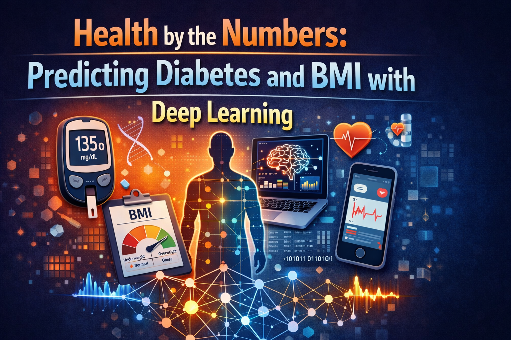

# Health by the Numbers: Predicting Diabetes and BMI with Deep Learning
**CSCI 6952 — Deep Learning | Spring 2026**

---

## Overview

This project uses the CDC Diabetes Health Indicators dataset to explore two
predictive modeling problems using deep learning. We will train and compare
multiple models of increasing complexity for both a classification and a
regression task, documenting the full experimental process from data exploration
to final results.

---

## Research Questions

**RQ1 — Classification**
Can we predict if a patient has diabetes based on lifestyle factors like BMI,
blood pressure, cholesterol levels, and physical activity?

**RQ2 — Regression**
Can we predict a patient's BMI based on lifestyle factors like age, income,
physical activity, general health rating, and smoking habits?

---

## Dataset

CDC Diabetes Health Indicators Dataset
Source: UC Irvine Machine Learning Repository
253,680 instances, 22 features, no missing values
See `data/README.md` for download instructions.

---

## Project Structure

```
DL-PROJECT-CSCI6952/
│
├── assets/                     # banner and figures
├── data/                       # dataset download instructions
├── docs/                       # project documentation
├── notebooks/                  # main colab notebook
├── poster/                     # poster template and final output
├── .gitignore
└── README.md
```

---

## Planned Approach

### Classification — Predicting Diabetes
We will train three models starting simple and increasing in complexity:
- Logistic Regression as the baseline
- A simple neural network with one hidden layer
- A deeper neural network with multiple hidden layers and dropout

Since the dataset has a class imbalance — far more non-diabetic than diabetic
cases — we will prioritize recall over accuracy. Missing a diabetic patient
is a much worse outcome than a false alarm.

### Regression — Predicting BMI
We will train three models using the same approach:
- Linear Regression as the baseline
- A simple neural network with one hidden layer
- A deeper neural network with batch normalization and dropout

---

## How to Run

1. Open `notebooks/diabetes_project.ipynb` in Google Colab
2. Set runtime to A100 GPU
3. Follow `data/README.md` to download the dataset
4. Run all cells from top to bottom

---

## Status
Experiment in progress. Results and figures will be updated here once training
is complete.