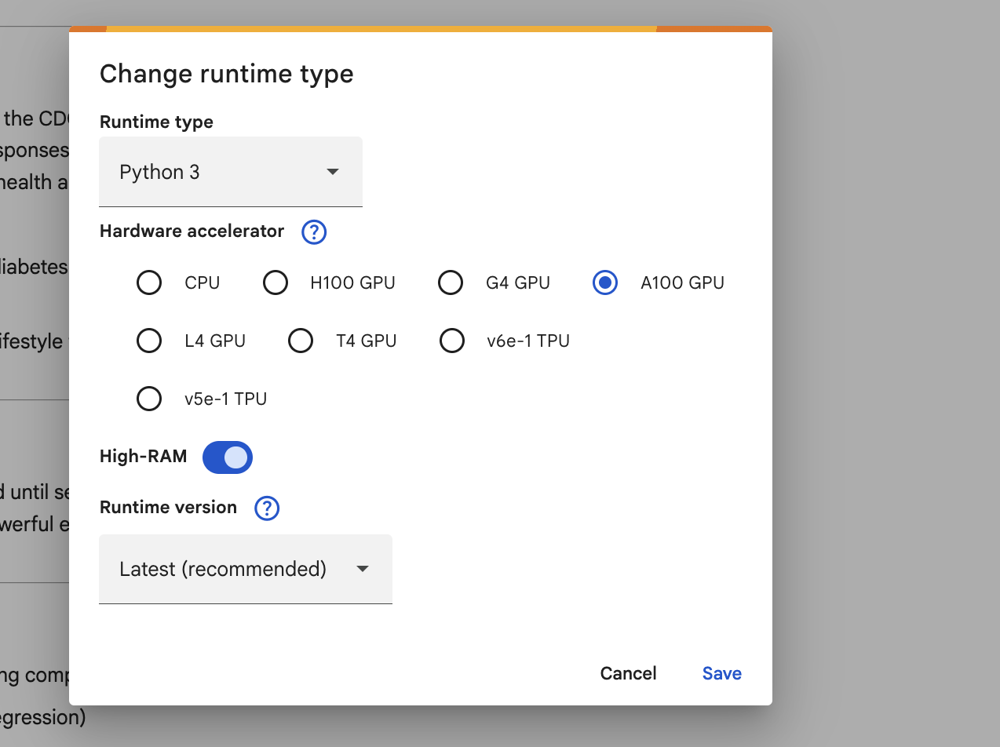
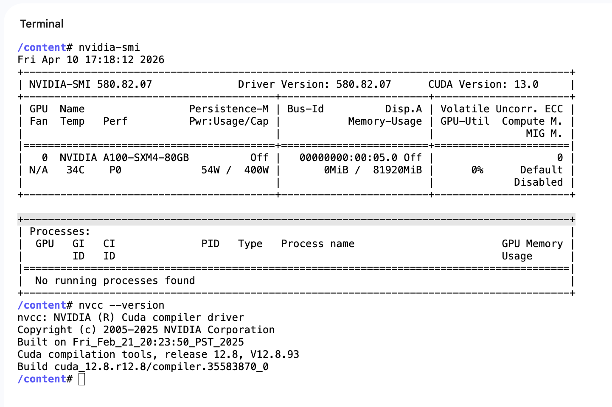

# Notebooks

All project notebooks are run on Google Colab. Links are listed below.

---

## Main Notebook

| Notebook | Description | Open in Colab | View Code |
|---|---|---|---|
| diabetes_project.ipynb | Main project notebook — data exploration, model training, and results |  | [View Code](notebooks/diabetes_project.ipynb) |

---

## Hardware & Runtime Environment

All experiments were executed using Google Colab with the following hardware configuration:

**Compute Hardware**
- GPU: NVIDIA A100-SXM4-80GB
- GPU Memory: 80 GB VRAM
- GPU Architecture: Ampere
- CUDA Driver Version: 13.0
- CUDA Toolkit Version: 12.8

**Execution Environment**
- Platform: Google Colab
- Accelerator: GPU Runtime
- Frameworks: PyTorch / TensorFlow (GPU-enabled)

This hardware configuration enabled large-batch deep learning training and accelerated experimentation for model development and evaluation.

---

## Google Colab Access (Student Setup)

This project was developed using **Google Colab**.

Students can start with the **free Colab tier**, which already provides GPU access suitable for experimentation and coursework.

### Step 1 — Use Your University Email
1. Sign in to Google using your **college/university email address**.
2. Open: https://colab.research.google.com
3. Create a new notebook.
4. Enable GPU:
   - `Runtime` → `Change runtime type`
   - Hardware accelerator → **GPU**
   - Save

The free tier may assign GPUs such as T4 or L4 depending on availability.

---

### Step 2 — Optional: Upgrade to Colab Pro / Pro+

For extended runtime sessions, faster GPUs, and higher compute limits, Google offers paid plans:

- **Colab Pro**
- **Colab Pro+**

Upgrading increases the likelihood of receiving high-performance GPUs.

> For this project, the runtime was upgraded to **Colab Pro**, which allowed access to an **NVIDIA A100 GPU** used for training and experimentation.

---

### Notes
- GPU availability in Colab is dynamic and cannot be selected manually.
- Restarting the runtime may assign different hardware.
- The project remains runnable on the free tier with smaller batch sizes.